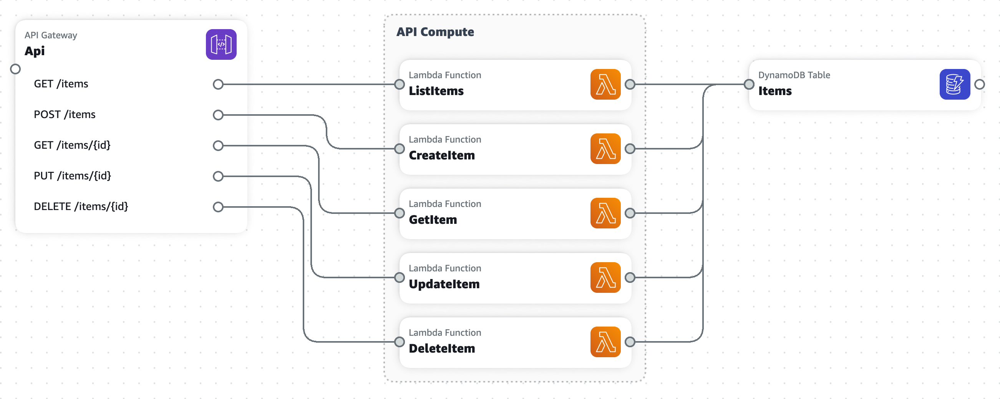

# CloudFormation Template Renderer

This is a simple tool that leverages AWS Application Composer's renderer to render CloudFormation templates. Since **CDK** also generates CloudFormation templates, this tool can be used to render the stacks created by CDK projects as well.

**Beta notice**: This tool is currently in beta. Please report any issues you encounter. also read the [Good to know](#good-to-know) section.

## Example output

Below image is the output of [this template](https://github.com/awslabs/aws-cloudformation-templates/blob/master/community/solutions/StaticWebSiteWithPipeline/stacks/pipeline.json).


## Installation

You can install it using npm:

```bash
# To use it as a CLI tool
npm install -g cf-render

# To use it as a library
npm install cf-render
```

## Usage - CLI

```bash
Usage: cf-render [options]

CLI to render AWS CloudFormation templates

Options:
  -V, --version                output the version number
  -i, --input <template-path>  Path to the cloudFormation template to render
  -o, --output <image-path>    Path to the output image. Must end with .png
  -h, --help                   display help for command

Examples:
  $ cf-render --input template.json --output template.png
  $ cf-render -i template.yaml -o template.png
```

## Usage - Library

```typescript
import { renderTemplate } from 'cf-render';

...
  await renderTemplate({
    inputPath: './template.yaml', 
    outputPath: './template.png'
  });
...
```

## Roadmap

- [x] Put it out there!
- [ ] Add support for screen size configuration
- [ ] Trim the output image. Currently the canvas area is too large.

## Good to know

- This tool uses the publicly available [AWS Application Composer instance](https://ide-toolkits.app-composer.aws.dev/index.html) to render the templates. I'm not aware of any legal issues with using this public instance. If you represent AWS and you have any issues with this tool, please let me know but just don't tell Jeff.
- Changes to the Application Composer's web UI might affect this library's functionality. If you encounter any issues, please report them. **If your life depends on generating diagrams from CloudFormation templates, you might want to consider using a different tool.** Otherwise, you can help improving this tool.
- You need to have an internet connection to use this tool.
